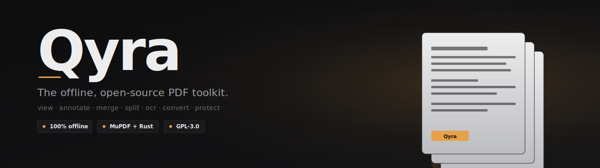
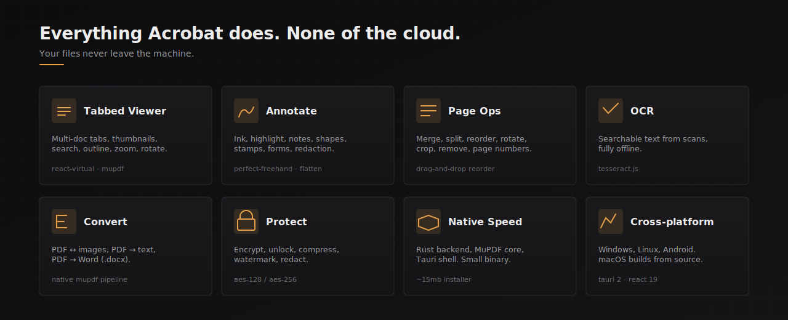

<div align="center">



<p>
  <a href="https://github.com/zParik/Qyra/releases"></a>
  <a href="LICENSE"></a>
  <a href="https://github.com/zParik/Qyra/stargazers"></a>
  <a href="https://github.com/zParik/Qyra/issues"></a>
</p>

<p>
  
  
  
  
  
  
</p>

<p>
  <a href="https://github.com/zParik/Qyra/actions/workflows/build-windows.yml"></a>
  <a href="https://github.com/zParik/Qyra/actions/workflows/build-linux.yml"></a>
  <a href="https://github.com/zParik/Qyra/actions/workflows/build-macos.yml"></a>
  <a href="https://github.com/zParik/Qyra/actions/workflows/build-android.yml"></a>
</p>

<p>
  <a href="#download">Download</a> ·
  <a href="#features">Features</a> ·
  <a href="#development">Development</a> ·
  <a href="#contributing">Contributing</a>
</p>

</div>

---

## Why Qyra?

Acrobat wants a subscription. Online PDF sites want your files. Qyra wants neither.

It's a desktop app that does the PDF work you actually do: view, mark up, merge, split, convert, OCR, protect. Everything runs locally. Nothing phones home. Open source under GPL-3.0.

<div align="center">
  
</div>

## Features

### Viewer
- Tabbed multi-document interface with persistent session
- Virtualized page list, thumbnails, zoom, rotate, search
- Outline (bookmarks), document metadata, recent-files library

### Annotation
- Freehand ink with pressure (`perfect-freehand`), highlighter, sticky notes
- Shapes, stamps, text boxes, comments
- Form filling, redaction (true content removal), watermarks, page numbers
- Flatten annotations into the page

### Page operations
- **Merge** multiple PDFs into one
- **Split** by range or page count
- **Reorder** via drag-and-drop
- **Remove**, **rotate**, **crop** pages

### Conversion
- PDF → images (PNG/JPEG, per page)
- Images → PDF
- PDF → plain text or layout-preserving text
- PDF → Word (`.docx`)
- **OCR** scanned pages via Tesseract.js, fully offline

### Security
- Password protect (AES-128/256)
- Unlock (with password)
- Compress and optimize

## Download

Grab a build from [Releases](https://github.com/zParik/Qyra/releases), or nightly artifacts from the latest [Actions run](https://github.com/zParik/Qyra/actions).

| Platform | Formats                       |
|----------|-------------------------------|
| Windows  | `.msi`, `.exe` (NSIS)         |
| Linux    | `.deb`, `.rpm`, `.AppImage`   |
| macOS    | `.dmg`, `.app.tar.gz`         |
| Android  | `.apk`                        |

### Linux on Wayland

The AppImage is patched to use the system `libwayland-client.so`, and WebKitGTK's DMA-buf renderer is disabled at startup. If you still hit issues:

```bash
LD_PRELOAD=/usr/lib/libwayland-client.so ./Qyra.AppImage
```

## Development

**Prerequisites**
- Node.js 20+
- Rust toolchain (stable)
- Tauri platform deps: https://tauri.app/start/prerequisites/
- **Windows:** run `cargo` from a *Visual Studio Developer PowerShell* so MSVC env vars are set for the native C deps (MuPDF).

```bash
npm install
npm run tauri dev
```

Lint:
```bash
npm run lint
```

### Building

```bash
npm run tauri build
```

Bundles land in `src-tauri/target/release/bundle/`.

### Android

CI builds an APK via `.github/workflows/build-android.yml`. Locally you need the Android NDK and the `aarch64-linux-android` Rust target.

## Project layout

```
src/                React 19 + TypeScript frontend
├─ tools/           One page per feature (Merge, Split, OCR, …)
├─ viewer/          PDF viewer + annotation surface
├─ components/      Shared UI
├─ store/           Zustand stores
└─ hooks/           React hooks

src-tauri/
├─ src/commands/    Rust Tauri commands, one file per feature
├─ src/pdf/         MuPDF bindings and PDF helpers
└─ src/utils/       Shared Rust utilities
```

## Tech stack

| Layer        | Choice                                                       |
|--------------|--------------------------------------------------------------|
| Shell        | [Tauri 2](https://tauri.app/)                                |
| Frontend     | React 19, TypeScript, Vite, Tailwind 4, Radix UI             |
| State        | Zustand, TanStack Query                                      |
| PDF engine   | [MuPDF](https://mupdf.com/) via Rust FFI                     |
| OCR          | [Tesseract.js](https://github.com/naptha/tesseract.js)       |
| Ink          | [perfect-freehand](https://github.com/steveruizok/perfect-freehand) |

## Contributing

Issues and PRs welcome. Conventions:
- One logical change per commit
- Many small commits per PR
- Merge commit only (no squash, no rebase)
- Reference an issue in the PR body when one exists

## License

[GPL-3.0](LICENSE). Use it, modify it, ship it, just keep it open.

---

<div align="center">
  <sub>Built by <a href="https://github.com/zParik">@zParik</a>. Star the repo if Qyra saves you a subscription.</sub>
</div>
